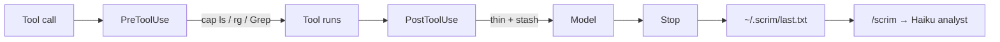

<p align="center">
  
</p>

<h1 align="center">Scrim</h1>

<p align="center">
  <em>The cloth between the tool and the model.</em>
</p>

<p align="center">
  Signal goes through. Glare does not.<br>
  Cost observability and tool-output optimization for <a href="https://code.claude.com">Claude Code</a>.
</p>

<p align="center">
  
  
  
  
  
</p>

<p align="center">
  
</p>

---

In a theater, a **scrim** hangs in front of the lamp. The scene stays lit. The bulb never hits your eyes.

Coding agents don't have one. They read every passing test, the full `ls -R`, and six Chrome screenshots — then you pay (or compact) for the glare.

Scrim hangs in front of the tool result.

```
  npm test · 4,212 lines                         what the model reads
┌────────────────────────────┐                 ┌──────────────────────┐
│ PASS auth   (42)           │                 │ FAIL checkout        │
│ PASS cart   (38)           │     scrim       │ AssertionError       │
│ PASS orders (57)           │  ───────────►   │ expected 500 == 502  │
│ FAIL checkout              │                 │ at checkout.test:118 │
│ PASS shipping (22)         │                 │                      │
│ … 4,180 more passing …     │                 │ [scrim] 4212 → 34 B  │
└────────────────────────────┘                 └──────────────────────┘
```

`Read` and `Edit` never go through it. Hooks **fail open**. It does not switch your model, and it does not change a Max subscription's Stripe charge.

## Four jobs

| | | |
|---|---|---|
| **See** | Transcripts + hooks | Cache-read share, list-price $, MB by tool |
| **Prevent** | `PreToolUse` | `ls -R` / `find` / `rg` capped *before* they run |
| **Thin** | `PostToolUse` | Tests, logs, grep, listings, Chrome images, fat JSON |
| **Delegate** | Subagents | `/scrim` and stash retrieve run on **Haiku**, not Opus |

Swarm watch counts open subagents and warns after eight. Claude Code will not let a hook cancel a spawn.

## Install

```bash
git clone git@github.com:nikshepsvn/scrim.git
claude --plugin-dir "$(cd scrim && pwd)"
```

Private marketplace (needs GitHub auth):

```text
/plugin marketplace add nikshepsvn/scrim
/plugin install scrim@scrim
```

Restart Claude Code. Run a tool. Then `/scrim`.

```bash
make test                        # 71 hermetic tests, stdlib only
python3 scripts/scrim.py doctor  # if nothing shows up
```

## `/scrim`

```
Scrim
Usage  (list prices, not Stripe)
  $1,204 API-eq   turns 412   cache-read 96%   cache-write 3.1M   out 80k
    claude-opus-5                    $980   300 turns
    claude-fable-5                   $210   112 turns
Tools  (this plugin)
  142 calls   4.20 MB in → 0.31 MB out   3.89 MB thinned
    mcp__claude-in-chrome__browser_batch   n=2     3.80 MB
```

```bash
python3 scripts/scrim.py --today           # local calendar day (add --json for machines)
python3 scripts/scrim.py --backfill        # lifetime, retries deduped
python3 scripts/scrim.py get <id> 118-130  # slice of an omitted original
python3 scripts/scrim.py stashes           # what's retrievable
python3 scripts/scrim.py kinds             # where the MB went, by kind
python3 scripts/scrim.py doctor            # is the chain healthy
python3 scripts/scrim.py prune             # trim old metrics + stash
```

Those dollars are **list prices** (Fable at Fable rates, Opus at Opus rates). Max/Ultra is a subscription — you are looking at quota shape, not a card charge.

## What gets through

| Kind | Policy |
|---|---|
| Tests / lint | FAIL, Error, traceback, tail |
| Logs | Drain-lite templates + counts |
| Grep / `rg` | Head + tail; FAIL/Error hits in the omitted middle appended anyway |
| `ls` / Glob | Head + omitted count |
| Chrome / Playwright | Images dropped, leftover text capped |
| Web | 16 KB cap |
| Other fat bash | Signal lines, else head+tail |
| `Read` / `Edit` | **Untouched** |

If the rewrite would not actually be smaller, the original goes through. PreToolUse caps only pure listings — pipes, redirects, and mutating `find` (`-exec`, `-delete`) are never rewritten, and `find` inside a string argument doesn't count.

gzip does not reduce tokens. The model has to read text.

Omitted bytes are stashed under `~/.scrim/blobs/` for seven days. Pull a slice with `scrim get` — preferably via the **scrim-retrieve** subagent, so the parent never loads the blob.

Copy [`config.example.json`](config.example.json) → `~/.scrim/config.json`. `"shrink": false` logs only. Every key: [docs/config.md](docs/config.md).

Old `~/.sift` / `~/.spend` directories are renamed on first run.

## Optional extract

Filters are the default. For logs that still need a brain, turn on OpenRouter. **`inception/mercury-2`** is the model that extracted in our bake-off. Use ≥4096 completion tokens.

```bash
export OPENROUTER_API_KEY=sk-or-...
```

```json
{
  "reducer": "openrouter",
  "reducer_model": "inception/mercury-2",
  "reducer_max_tokens": 4096,
  "reducer_timeout_sec": 20
}
```

The macOS Claude app often ignores shell env. You can set `reducer_api_key` in `~/.scrim/config.json`. Do not commit that file.

Do not use Morph or Inkling as the reducer. Morph reprints the dump. Inkling spends the budget on hidden reasoning. Notes: [docs/eval.md](docs/eval.md). Backup: `google/gemini-2.5-flash`.

## How it hangs



Any hook error prints `{}` and exits 0. The agent sees the original result.

## Privacy

Default path: nothing extra leaves the machine. Metrics are counts and tool names.

Reducer on: a truncated dump is sent to OpenRouter or Anthropic. Cache lives in `~/.scrim/reducer-cache/`.

## Codex

Tracking works if you point Codex `PostToolUse` at `hooks/posttooluse.py`. Replacing output is first-class in Claude Code; confirm it on your Codex build. [codex/README.md](codex/README.md).

## Docs

| | |
|---|---|
| [How it works](docs/how-it-works.md) | Hook pipeline |
| [Config](docs/config.md) | Every key |
| [Eval](docs/eval.md) | Measured save rates and model bake-off |
| [Security](SECURITY.md) | Fail-open and what leaves the machine |

## License

[MIT](LICENSE)
