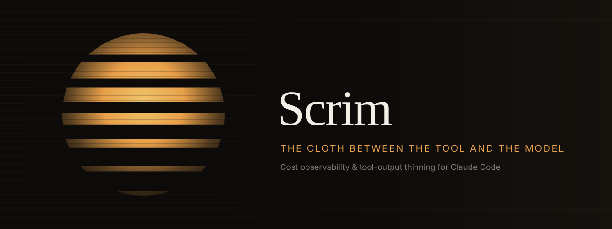
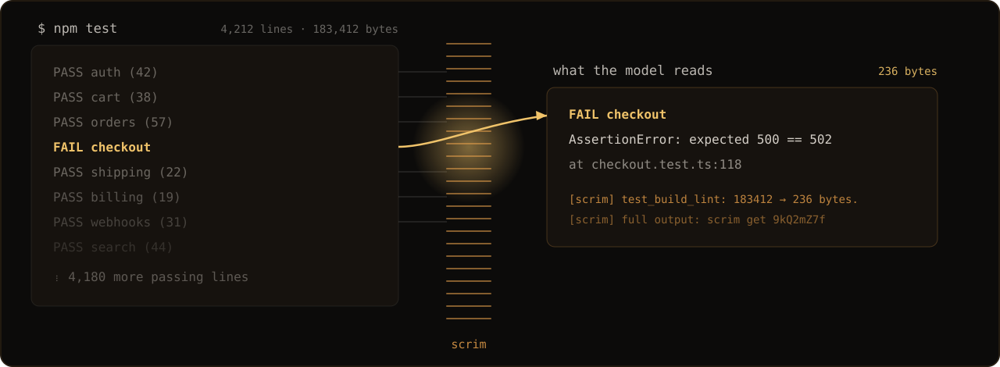
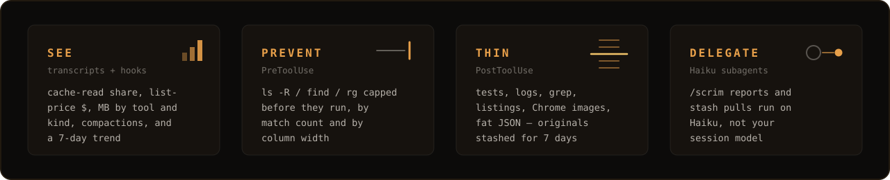
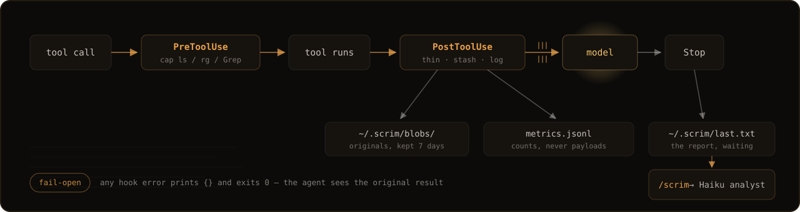
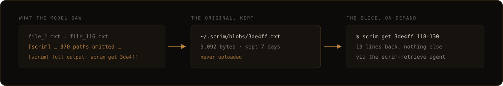

<p align="center">
  
</p>

<p align="center">
  <strong>Signal goes through. Glare does not.</strong>
</p>

<p align="center">
  
  
  
  
  
  
</p>

<p align="center">
  <a href="#install">Install</a>&ensp;·&ensp;<a href="#four-jobs">Four jobs</a>&ensp;·&ensp;<a href="#how-it-hangs">How it hangs</a>&ensp;·&ensp;<a href="#what-gets-through">What gets through</a>&ensp;·&ensp;<a href="#the-cli">CLI</a>&ensp;·&ensp;<a href="#codex">Codex</a>&ensp;·&ensp;<a href="docs/config.md">Config</a>
</p>

<br>

In a theater, a **scrim** hangs in front of the lamp. The scene stays lit. The bulb never hits your eyes.

Coding agents don't have one. They read every passing test, the full `ls -R`, and six Chrome screenshots — then you pay (or compact) for the glare. Scrim hangs in front of the tool result:

<p align="center">
  
</p>

<p align="center">
  <sub>Measured on replay, not promised: <b>47%</b> of bytes cut on 28,994 real Claude&nbsp;Code calls&ensp;·&ensp;<b>68%</b> on OpenHands SFT&ensp;·&ensp;<b>104&nbsp;MB → 3&nbsp;MB</b> of Chrome screenshots&ensp;·&ensp;<b>zero</b> dropped <code>FAIL</code> lines — <a href="docs/eval.md">eval notes</a></sub>
</p>

<br>

Three things it will never do: touch `Read` or `Edit`, break your session (hooks **fail open** — on any error the agent sees the original result), or switch your model.

## Install

```bash
git clone git@github.com:nikshepsvn/scrim.git
claude --plugin-dir "$(cd scrim && pwd)"
```

Or from the marketplace:

```text
/plugin marketplace add nikshepsvn/scrim
/plugin install scrim@scrim
```

Restart Claude Code. Run a tool. Then `/scrim`:

```
Scrim
Usage  (list prices, not Stripe)
  $1,204 API-eq   turns 412   cache-read 41,236,801 (96%)   cache-write 3,102,455   out 81,340
    claude-opus-5                    $980   300 turns
    claude-fable-5                   $210   112 turns
Tools  (this plugin)
  142 calls   4.20 MB in → 0.31 MB out   3.89 MB thinned  (61 calls)
    mcp__claude-in-chrome__browser_batch     n=2       3.80 MB
  stashed originals  12  (scrim get <id>)
  compactions  2  (each one = a window that overflowed)
```

Those dollars are **list prices** (Fable at Fable rates, Opus at Opus rates). Max/Ultra is a subscription — you are looking at quota shape, not a card charge.

If nothing shows up: `python3 scripts/scrim.py doctor`. Tests are hermetic, stdlib only: `make test`.

## Four jobs

<p align="center">
  
</p>

<p align="center">
  <sub>Swarm watch warns after <b>8</b> open subagents&ensp;·&ensp;compactions are logged — each one is a window that overflowed, the exact event thinning exists to delay&ensp;·&ensp;one minified-JS <code>rg</code> hit can be a 200&nbsp;KB line, hence the column cap</sub>
</p>

## How it hangs

<p align="center">
  
</p>

<p align="center">
  <sub>Fail-open covers even a missing hook file, an import error, or a Python&nbsp;2 <code>python</code>&ensp;·&ensp;<code>scrim.py doctor</code> checks the whole chain</sub>
</p>

## What gets through

| Kind | Policy |
|---|---|
| Tests / lint | FAIL, Error, traceback **with its stack frames**, tail |
| Logs | Drain-lite templates + counts, plus the raw last lines (the crash is usually at the end) |
| Grep / `rg` | Head + tail; FAIL/Error hits in the omitted middle appended anyway |
| `ls` / Glob | Head + omitted count |
| Chrome / Playwright | Images dropped, leftover text capped |
| Web | 16 KB cap |
| Other fat bash | Signal lines, else head+tail |
| `Read` / `Edit` | **Untouched** |
| `scrim get` | **Untouched** — retrieval never re-thins the blob you asked to recover |

If the rewrite would not actually be smaller, the original goes through. PreToolUse caps only pure listings — pipes, redirects, and mutating `find` (`-exec`, `-delete`) are never rewritten, and `find` inside a string argument doesn't count.

gzip does not reduce tokens. The model has to read text.

## Nothing is lost

<p align="center">
  
</p>

<p align="center">
  <sub>Pull through the <b>scrim-retrieve</b> subagent so the parent never loads the blob&ensp;·&ensp;retrieval output is itself exempt from thinning&ensp;·&ensp;<code>scrim stashes</code> lists what's live</sub>
</p>

To tune it, copy [`config.example.json`](config.example.json) → `~/.scrim/config.json`. `"shrink": false` logs only. Every key: [docs/config.md](docs/config.md). Old `~/.sift` / `~/.spend` directories are renamed on first run.

## The CLI

```bash
python3 scripts/scrim.py --today           # local calendar day (add --json for machines)
python3 scripts/scrim.py days              # 7-day trend: claude $, codex $, turns, tool MB
python3 scripts/scrim.py --backfill        # lifetime, retries deduped
python3 scripts/scrim.py get <id> 118-130  # slice of an omitted original
python3 scripts/scrim.py stashes           # what's retrievable
python3 scripts/scrim.py kinds             # where the MB went, by kind
python3 scripts/scrim.py doctor            # is the chain healthy
python3 scripts/scrim.py prune             # trim old metrics + stash
python3 scripts/scrim.py --config          # effective config + warnings
```

`days` takes a count (`days 30`) and covers both agents:

```
last 7 days  (list prices, not Stripe)
day           claude $  codex $   turns     tool MB in→out
2026-08-18         382        0   1,266        4.20 → 0.31
2026-08-17         129        0     306                  -
```

### Statusline

Live numbers in every turn instead of a post-hoc report — wire `scrim statusline` into Claude Code's `statusLine` slot in `~/.claude/settings.json`:

```json
"statusLine": { "type": "command", "command": "python3 /ABS/PATH/TO/scrim/scripts/scrim.py statusline" }
```

```
Fable · ctx 42% · $1.23 · tools 4.2→0.3 MB · 3.9 thinned · compacted ×1
```

## Codex

Codex CLI 0.146+ runs the same `hooks.json` format — verified live, not assumed:

| | on Codex |
|---|---|
| **See** — tracking, stash, Stop report, `days` | ✅ verified live |
| **Usage $** — parsed from `~/.codex/sessions` rollouts | ✅ its own block in `/scrim` |
| **Prevent** — PreToolUse input caps | ⚠️ Code Mode `exec` skips PreToolUse ([#23411](https://github.com/openai/codex/issues/23411)) |
| **Thin** — neutral output rewrite | ❌ not shipped ([#34895](https://github.com/openai/codex/issues/34895)); opt-in `codex_block_thin` uses the `decision:"block"` lever instead |

```bash
make codex-hooks     # install, then trust once via /hooks in the Codex TUI
```

<p align="center">
  <sub>Verified on codex-cli 0.146.1, not assumed: <b>5,092&nbsp;B → 762&nbsp;B</b> in model context via the block lever&ensp;·&ensp;<code>hooks.json</code> byte-compatible with Claude Code's&ensp;·&ensp;Scrim detects Codex (<code>turn_id</code>) and never reports bytes as thinned that Codex didn't drop — <a href="codex/README.md">full matrix</a></sub>
</p>

## Optional: extract with a model

<details>
<summary>Filters are the default. For logs that still need a brain, turn on OpenRouter.</summary>
<br>

**`inception/mercury-2`** was the only model in our bake-off that behaved like a reducer at hook latency. Use ≥4096 completion tokens.

```bash
export OPENROUTER_API_KEY=sk-or-...
```

```json
{
  "reducer": "openrouter",
  "reducer_model": "inception/mercury-2",
  "reducer_max_tokens": 4096,
  "reducer_timeout_sec": 20
}
```

The macOS Claude app often ignores shell env. You can set `reducer_api_key` in `~/.scrim/config.json`. Do not commit that file.

Do not use Morph or Inkling as the reducer. Morph reprints the dump. Inkling spends the budget on hidden reasoning. Notes: [docs/eval.md](docs/eval.md). Backup: `google/gemini-2.5-flash`.

</details>

## Privacy

Default path: nothing extra leaves the machine. Metrics are counts and tool names.

Reducer on: a truncated dump is sent to OpenRouter or Anthropic. Cache lives in `~/.scrim/reducer-cache/`.

## Docs

| | |
|---|---|
| [How it works](docs/how-it-works.md) | Hook pipeline |
| [Config](docs/config.md) | Every key |
| [Eval](docs/eval.md) | Measured save rates and model bake-off |
| [Codex](codex/README.md) | Verified compatibility matrix |
| [Security](SECURITY.md) | Fail-open and what leaves the machine |

## License

[MIT](LICENSE)
